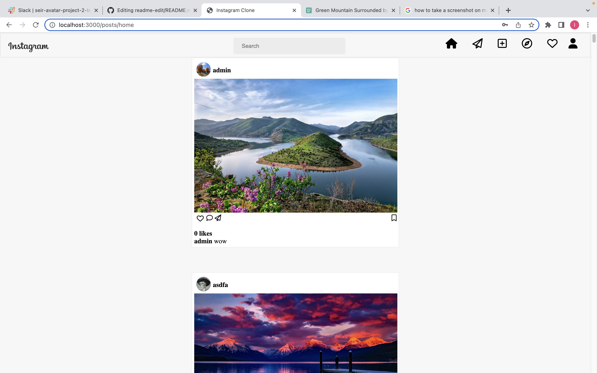

# Instagram Clone

## Link
Here is the <a href="https://insta-clone33.herokuapp.com/" target='_blank'>link to website</a>

## Technologies Used
- HTML
- CSS
- Javascript
- Node js
- Express js
- MongoDB
- Mongoose
- Colorhunt.co
- Pexels.com (for images)

## Getting Started
<!-- link to website -->
This app is a clone of Instagram built using express. Sign up to create a new user profile. Sign in to be able to view the home and profile pages. 

## Screenshot

## Future Enhancements
### Functionality 
- changeable username and profile picture
- edit captions on pictures
- view profile 
- views posts under username
- delete user posts
- post public images
- admin capabilities/ can delete/edit all posts
### Features to add
- See saved and liked posts
- COMMENTS
- View other profiles

### Issues
- picture loading not yet optimized
- Must re login to save profile udpates
- Username not fully linked to posts
- Posts profile images can be different
- Post and User schema not linked
- Like button not fully functional

